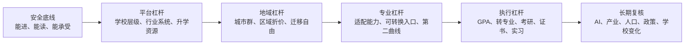
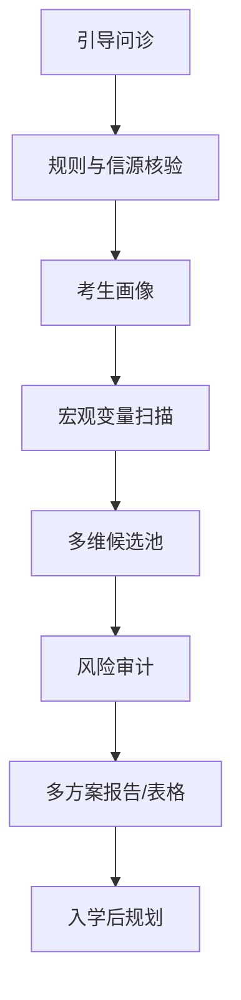
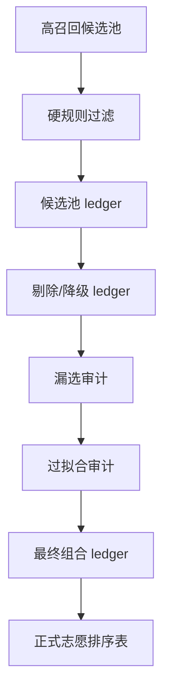

# 人生志愿杠杆 Life Leverage for College Admission


面向中国高考志愿填报的非商用 AI Agent Skill。它不是“替你拍板”的神谕，而是一套帮助考生和家庭把分数、位次、省份规则、院校专业、家庭约束和长期人生机会放在同一张决策地图里的方法与工具。

> **重要边界**  
> 本项目不是全国院校数据库，不是已回测校准的录取概率模型，也不替代省级考试院、高校招生网和官方招生章程。没有完整官方招生计划、历史位次、专业组变化和模型回测时，只能输出候选发现、风险审计、情景模拟、概率区间和待核验事项。

## 项目缘起

这个项目来自一次真实的 2025 年高考志愿填报实践：家中亲友的小孩处在选择空间并不宽裕的分数段，省内热门路径竞争激烈，简单随大流很容易只得到低杠杆结果。于是我围绕她的真实分数、位次、选科、家庭约束和长期发展可能性，设计了一套 AI Agent 辅助框架，让 Agent 从数百个候选院校和专业路径里反复扩展、筛选、降级、复核，寻找那些基本盘可接受、存在结构性“捡漏”特征、未来可能被重新定价的人生机会。

最终方案没有依赖“神预测”，而是遵循一个朴素原则：先守住可录取和可接受底线，再寻找非对称上行空间。该考生最终进入了一所当时分数段内相对稳妥、但具备区域位置、主管部门和平台变化预期的高校；入学不到一年，学校完成合并更名，成为中央部委直属高校。这个结果不是可复制的录取承诺，却证明了一个方向：在信息不充分、机会很窄的情况下，AI Agent 可以帮助家庭把候选池、证据、风险和长期杠杆系统化，而不是只凭印象、焦虑和热门叙事做决定。

## 给谁用

- 高考考生、家长、老师、公益志愿填报协助者。
- 已经在使用 AI Agent 工具的人，例如 Codex、Claude Code、Cursor、Kimi Code、OpenCode、Gemini CLI、Qwen Code、Aider、Cline/Roo Code、Continue、Zed/Zcoe、Windsurf、GitHub Copilot Coding Agent、Trae 等。
- 希望用证据和结构化判断辅助志愿填报，而不是被热门城市、热门专业、短视频叙事或“唯一正确答案”牵着走的人。

## 小白用户怎么选工具

你不需要一开始就理解所有 Agent 工具。先判断自己属于哪种情况：

### 方案 A：能正常访问国际模型和开发工具

优先使用能读取本地文件、执行命令、按需加载 reference 的 Agent 工具：

- [Codex](https://developers.openai.com/codex/)：最适合直接使用本仓库的 Skill 结构。
- [Claude Code](https://docs.anthropic.com/en/docs/claude-code/overview)：适合在终端中读取仓库、修改文档和执行脚本。
- [Cursor](https://cursor.com/)、[Windsurf](https://windsurf.com/)、[GitHub Copilot Coding Agent](https://docs.github.com/en/copilot)：适合图形化 IDE 用户。
- [OpenCode](https://opencode.ai/)、[Aider](https://aider.chat/)、[Cline/Roo Code](https://cline.bot/)、[Continue](https://www.continue.dev/)：适合愿意配置模型 API 的用户。

### 方案 B：中国大陆地区没有稳定网络代理

可以换成支持读取本地仓库、执行工具或接入自定义模型 API 的国产/开源 Agent 工具，或者把本项目当作“方法论 + 提示词 + 表格规范”使用：

- 优先选择支持本地文件读取、终端命令、工具调用、规则文件或知识库的工具。
- 如果工具不认识 Codex Skill，也可以让它先读取 [SKILL.md](life-leverage-college-admission/SKILL.md)，再按路由读取 `references/`。
- 国内模型可优先考虑 GLM、DeepSeek、Kimi、Qwen 等提供的 API 或平台能力。常见做法是选择支持 OpenAI-compatible 或 Anthropic-compatible 接口的 Agent 工具，然后配置 `base_url`、`api_key` 和 `model`。
- 可参考的官方文档入口：[GLM / Z.AI](https://docs.z.ai/devpack/quick-start)、[DeepSeek API](https://api-docs.deepseek.com/)、[Kimi API](https://platform.kimi.ai/docs/api/overview)、[Qwen API](https://qwen.ai/apiplatform)、[Qwen Code](https://qwenlm.github.io/qwen-code-docs/en/users/configuration/auth/)。
- 如果当前 Codex、Claude Code 或某个 IDE 版本不支持自定义模型服务，不要强行改 Skill。更稳妥的做法是换用 OpenCode、Aider、Continue、Cline/Roo Code、Qwen Code 等支持自定义模型提供方的工具来读取本仓库。
- 如果只能使用网页版聊天，也可以复制 `SKILL.md` 的核心定位、[引导式问诊](life-leverage-college-admission/references/guided-intake.md) 和 [输入输出规范](life-leverage-college-admission/references/input-output-schema.md) 的相关片段，让模型先问诊再分析。缺点是不能自动运行脚本，也更容易遗漏候选池 ledger。

### 方案 C：只想先试一下

最简单的做法：

1. 准备“省份、年份、选科/科类、分数、位次、批次、预算、不可接受项、学生本人偏好、家庭约束”。
2. 把这些信息交给你正在使用的 Agent。
3. 要求它读取 `life-leverage-college-admission/SKILL.md`，先补问缺失信息，不要直接给唯一答案。
4. 等有候选表后，再考虑使用 `ledger_tool.py` 做机械校验。

判断一个工具是否适合本项目，只看三点：能否读取本地文件，能否按需打开 `references/`，能否执行 Python 脚本。三点都具备最好；只能聊天也能用，但只能做轻量咨询。

## 立即使用

### Codex Skill

把 `life-leverage-college-admission/` 作为 Skill 安装或复制到你的 Codex Skill 目录，然后在对话中使用：

```text
使用 $life-leverage-college-admission 为一名中国高考考生生成证据驱动、风险可控、兼顾长期人生杠杆的志愿填报建议。
```

### 通用 AI Agent

让你的 Agent 读取：

- [Skill 入口](life-leverage-college-admission/SKILL.md)
- [引导式问诊](life-leverage-college-admission/references/guided-intake.md)
- [输入输出规范](life-leverage-college-admission/references/input-output-schema.md)
- [数据与模型路线图](life-leverage-college-admission/references/data-and-model-roadmap.md)

然后按 `SKILL.md` 的渐进式披露路由读取其他 reference。不要一次性把所有文档塞进上下文。

### 候选表工具

如果你已经整理了候选 CSV，可以用脚本做机械校验：

```bash
PYTHONDONTWRITEBYTECODE=1 python3 life-leverage-college-admission/scripts/ledger_tool.py selftest
python3 life-leverage-college-admission/scripts/ledger_tool.py template --output candidates.csv
python3 life-leverage-college-admission/scripts/ledger_tool.py validate-candidate-table candidates.csv
```

脚本只做字段、状态、硬约束和 ledger 校验，不判断学校质量，也不预测录取概率。

## 最小资料清单

开始前尽量准备：

| 信息 | 说明 |
| --- | --- |
| 省份和年份 | 不同省份、年份规则可能不同 |
| 选科/科类 | 新高考选科、传统文理、艺体专项等 |
| 分数和位次 | 位次优先于分数 |
| 批次 | 本科批、专科批、提前批、专项等 |
| 家庭预算 | 学费、生活费、民办/中外合作容忍度 |
| 不可接受项 | 地区、专业、学费、调剂下限、身体限制 |
| 学生本人偏好 | 兴趣、短板、职业想象、城市接受度 |
| 家庭约束 | 家长期望、照护责任、资源、应急储备 |

只给“省份 + 分数”时，本项目只能做粗筛，会优先提示补齐位次、选科、批次和家庭约束。

## 方法论：选择哲学六轴



核心不是押中某个“神校”，而是在安全边界内识别当前可进入、基本盘可接受、未来可能被重新定价的结构性机会。

## 工作流





## 不要这样用

- 不要只给一个分数，就要求唯一答案。
- 不要把第三方工具的概率当成官方录取保证。
- 不要上传身份证号、准考证号、手机号、完整住址等敏感信息。
- 不要让商业志愿填报机构把本项目包装成付费服务。
- 不要把“升格、合并、更名、捡漏、热门 AI 专业”当作确定收益。

## 源码开放但非商用

本项目是公益导向的“源码开放、非商用”项目，不是 OSI 定义下的无限制开源项目。

- 文档、Skill、方法论和模板：采用 [CC BY-NC-SA 4.0](LICENSES/CC-BY-NC-SA-4.0.txt)。
- 脚本代码：采用 [PolyForm Noncommercial 1.0.0](LICENSES/PolyForm-Noncommercial-1.0.0.md)。
- 详情见 [LICENSE](LICENSE) 和 [非商用声明](NONCOMMERCIAL.md)。

商业志愿填报咨询机构、教育咨询公司、SaaS 平台、付费知识产品、内部商业工具和其他营利性服务，不得基于本项目进行二次开发、集成、训练、包装或付费交付，除非获得项目维护者的单独书面授权。

## 责任边界

本项目只提供教育决策辅助，不提供录取承诺、结果保证或人生发展保证。正式填报必须以省级考试院、高校招生网、招生章程和官方志愿系统为准。详见 [DISCLAIMER.md](DISCLAIMER.md)。

## GitHub 发现性信息

建议仓库 About：

```text
Non-commercial AI Agent Skill for evidence-driven Chinese Gaokao college admission planning.
```

建议 topics：

```text
gaokao, college-admission, china-education, ai-agent, agent-skill, codex, claude-code, cursor, decision-support, noncommercial, education, prompt-engineering, college-planning, admissions, chinese, public-interest
```

没有远端仓库或 `owner/repo` 前，不应执行 GitHub About、topics 或 homepage 远端修改。

## 贡献

欢迎公益方向的规则补充、信源核验、文档改进、脚本修复和压力测试。请先阅读 [CONTRIBUTING.md](CONTRIBUTING.md)。不要提交任何真实考生隐私信息。
